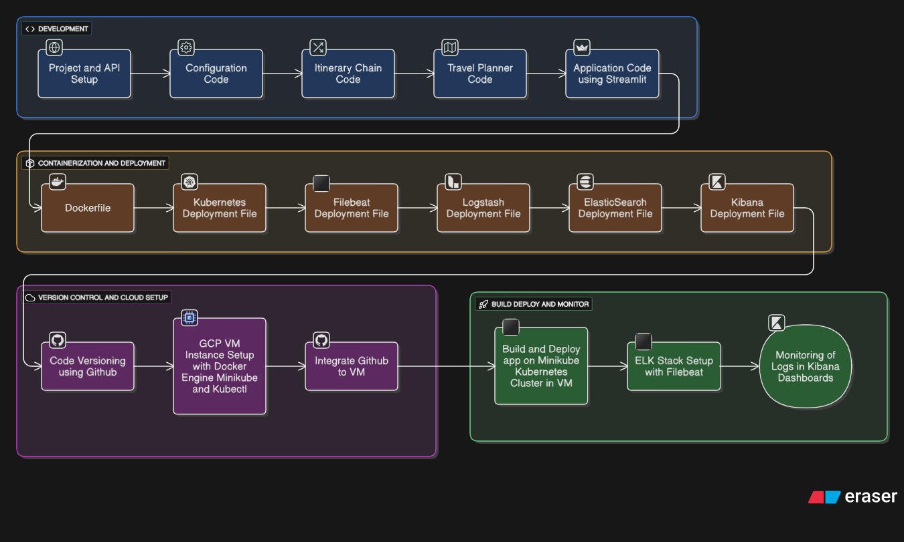

# AI Travel Planner: Intelligent Itinerary Generation System


[](https://github.com/HamzaImtiaz03/AI_Travel_Planner)
[](https://opensource.org/licenses/MIT)
[](https://www.python.org/)
[](https://www.docker.com/)
[](https://kubernetes.io/)
[](https://cloud.google.com/)

## Overview

The **AI Travel Planner** is a sophisticated AI-powered application that generates personalized travel itineraries based on user inputs such as destinations, preferences, budgets, and durations. Leveraging advanced language models and chain-based reasoning, it creates detailed, optimized travel plans, making it an essential tool for travelers, tour operators, and travel tech enthusiasts.

This project demonstrates a full MLOps lifecycle, from local development with Streamlit for interactive UI to cloud-native deployment on Google Cloud Platform (GCP) using Kubernetes (via Minikube). It incorporates robust logging and monitoring with the ELK Stack (Elasticsearch, Logstash, Kibana) augmented by Filebeat for comprehensive observability. Built for scalability and reliability, it integrates real-time data processing, secure configurations, and automated deployments to deliver seamless travel planning experiences.

## Key Features

- **AI Itinerary Generation**: Uses LangChain for modular chains, Groq for fast inference, and custom travel planner logic to create tailored itineraries including flights, accommodations, activities, and tips.
- **Interactive Frontend**: Streamlit-based web app for user-friendly input and real-time plan visualization.
- **Secure Configurations**: Environment variables and Kubernetes secrets for API keys (e.g., Groq).
- **Containerization & Orchestration**: Dockerized app with Kubernetes deployments for the core application and ELK components.
- **Logging & Monitoring**: ELK Stack with Filebeat for collecting, processing, and visualizing logs from Kubernetes pods, enabling proactive issue detection.
- **Cloud Integration**: Deployed on GCP VM instances with Minikube for local Kubernetes simulation.
- **Version Control**: GitHub for code versioning and collaboration.
- **Persistent Storage**: Kubernetes PersistentVolumeClaims (PVCs) for Elasticsearch data durability.

## Architecture

The system is structured in phases—development, containerization, version control, and build/deploy/monitor—as depicted in the flowchart below:

 <!-- Replace with actual image URL or embed -->

### High-Level Breakdown:
1. **Development**: Project setup with API integrations, configuration code, itinerary chain logic, travel planner modules, and Streamlit application.
2. **Containerization & Deployment**: Dockerfile for app packaging, Kubernetes YAMLs for app deployment, Filebeat (DaemonSet for log collection), Logstash (log processing), Elasticsearch (search/storage), and Kibana (visualization).
3. **Version Control & Cloud Setup**: GitHub versioning, GCP VM instantiation with Docker and Minikube, GitHub integration to VM.
4. **Build, Deploy & Monitor**: App build/deployment on Minikube cluster, ELK Stack setup with Filebeat, log monitoring via Kibana dashboards.

This architecture ensures end-to-end traceability, scalability, and fault tolerance for production-grade travel planning.

## Technologies Used

- **AI/ML Frameworks**: LangChain (core, Groq, Community).
- **Frontend**: Streamlit (interactive web apps).
- **Environment Management**: Python-dotenv (secrets handling).
- **Containerization & Orchestration**: Docker (containerization), Kubernetes (via Minikube), Kubectl (management).
- **Logging & Monitoring**: Elasticsearch (search engine), Logstash (log processing), Kibana (dashboards), Filebeat (log shipping).
- **Cloud Platform**: Google Cloud Platform (GCP VM).
- **Version Control**: GitHub.
- **Persistence**: Kubernetes PVCs.

Full dependencies are listed in `requirements.txt`.

## Installation

### Prerequisites
- Python 3.10+
- Git
- Docker (for containerization)
- Google Cloud Platform Account (for deployment)
- API Keys: Groq (stored in `.env`)
- Optional: Minikube and kubectl for local Kubernetes testing

### Steps
1. **Clone the Repository**:
   ```
   git clone https://github.com/HamzaImtiaz03/AI_Travel_Planner.git
   cd AI_Travel_Planner
   ```

2. **Set Up Virtual Environment** (Recommended):
   ```
   python -m venv venv
   source venv/bin/activate  # On Unix/Mac
   # Or on Windows: venv\Scripts\activate
   ```

3. **Install Dependencies**:
   ```
   pip install -r requirements.txt
   ```

4. **Configure Environment Variables**:
   Create a `.env` file in the root directory:
   ```
   GROQ_API_KEY=your_groq_api_key
   # Add other variables as needed
   ```

## Usage

1. **Run the Application Locally**:
   ```
   streamlit run app.py
   ```
   - Access the planner at `http://localhost:8501`.
   - Input travel details (e.g., destination, dates, budget) to generate itineraries.

2. **Query Examples**:
   - "Plan a 7-day trip to Paris for a family of 4 with a $2000 budget."
   - "Suggest adventure activities in Tokyo for solo travelers."
   - The system uses LangChain chains to process inputs and output structured plans.

3. **Customization**:
   - Modify itinerary logic in chain modules.
   - Integrate additional APIs for real-time data (e.g., flights, weather).

## Deployment

This project includes a complete deployment pipeline for GCP with Kubernetes and ELK monitoring.

### Prerequisites
- GCP VM Instance (configured as per `FULL DOCUMENTATION.md`).
- Minikube, Docker, and Kubectl installed on the VM.
- Kubernetes secrets for API keys.

### Pipeline Overview
1. **Build Docker Image**: Containerize the Streamlit app.
2. **Deploy Core App**: Apply `k8s-deployment.yaml` for Deployment and LoadBalancer Service.
3. **Set Up ELK Stack**: Create `logging` namespace; deploy Elasticsearch (with PVC), Logstash, Kibana, and Filebeat.
4. **Access & Monitor**: Port-forward services; view logs in Kibana.

### Detailed Steps
- Follow `FULL DOCUMENTATION.md` for GCP VM setup, Docker/Minikube installation, Kubernetes namespace creation, secrets management, and ELK deployments.
- Build and run Docker image locally:
  ```
  docker build -t streamlit-app .
  docker run -p 8501:8501 streamlit-app
  ```
- Deploy to GCP Kubernetes:
  ```
  eval $(minikube docker-env)
  docker build -t streamlit-app:latest .
  kubectl create secret generic llmops-secrets --from-literal=GROQ_API_KEY=your_key
  kubectl apply -f k8s-deployment.yaml
  minikube tunnel  # For LoadBalancer access
  kubectl port-forward svc/streamlit-service 8501:80 --address 0.0.0.0
  ```
- For ELK:
  ```
  kubectl create namespace logging
  kubectl apply -f elasticsearch.yaml
  kubectl apply -f logstash.yaml
  kubectl apply -f kibana.yaml
  kubectl apply -f filebeat.yaml
  kubectl port-forward svc/kibana -n logging 5601:5601 --address 0.0.0.0
  ```
- Access Kibana at `http://external-ip:5601` to set up index patterns (`filebeat-*`) and explore logs.

Once deployed, access the app via the external IP on port 8501 and monitor via Kibana dashboards.

## Contributing

Contributions are welcome to enhance planning algorithms, add features, or improve monitoring! To contribute:
1. Fork the repository.
2. Create a feature branch (`git checkout -b feature/YourFeature`).
3. Commit changes (`git commit -m 'Add YourFeature'`).
4. Push to the branch (`git push origin feature/YourFeature`).
5. Open a Pull Request.

Adhere to code standards and include documentation updates.

## License

This project is licensed under the MIT License - see the [LICENSE](LICENSE) file for details.

## Acknowledgments

- Frameworks: LangChain, Groq, Streamlit.
- Tools: Docker, Kubernetes, Minikube, Elasticsearch, Logstash, Kibana, Filebeat, GCP.
- Inspired by AI applications in travel and tourism for personalized experiences.

For questions or support, open an issue on GitHub or contact [Hamza Imtiaz](mailto:hamzaimtiaz8668@gmail.com).

---

*Built by Hamza Imtiaz | Crafting Your Dream Journeys with AI*